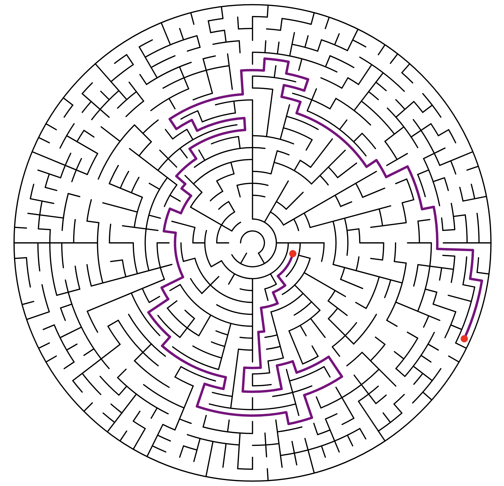

# Circle Maze Generator

A circular maze generator that creates mazes with configurable complexity.
Available as both a CLI tool and a WebAssembly web application.

## Features

- Generate random circular mazes with customizable number of circles
- Find and highlight the longest path (tree diameter)
- Export to SVG format
- Save/load mazes as JSON
- WebAssembly-powered web interface

## Screenshot

## Documentation

Build instructions, CLI and web usage, project structure, and algorithm details
live in [CLAUDE.md](CLAUDE.md).
